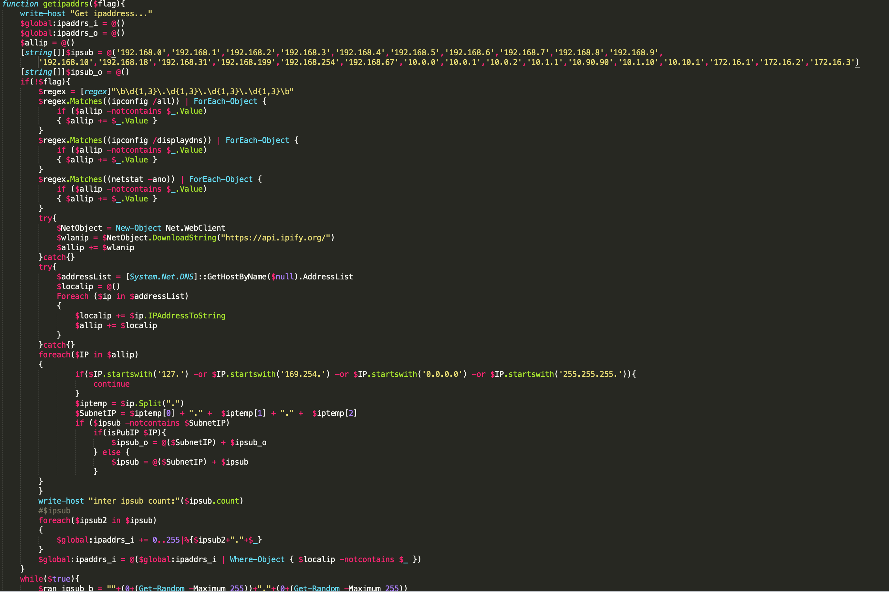

# powershell-Trojan
TrojanDropper/PS.Maloader.d

### "驱动人生"病毒 简介

```
"驱动人生"病毒自2018年出现，至今出现多个变种，不断进行技术优化以躲避安全软件的查杀监测。
该病毒利用永恒之蓝漏洞、SMBGhost漏洞等多种高危漏洞对Windows、Linux下的主机进行入侵感染，在入侵成功之后不仅会下载挖矿文件进行挖矿，还会释放传播模块继续入侵感染其他终端，并且病毒所使用的Powershell脚本经过多层混淆用以逃避安全软件的查杀。
```



